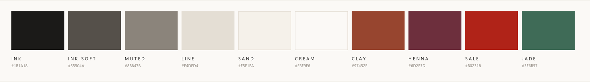

<div align="center">

<br/>

# D R E A M &nbsp; S T I T C H

**B Y &nbsp; S K**

<br/>

**P U R E &nbsp; C O T T O N &nbsp; · &nbsp; C O T T O N &nbsp; Z E E N &nbsp; · &nbsp; C O T T O N &nbsp; S A T I N**

<br/>

A white-and-purple storefront for a premium bedsheet house —<br/>
king and single sets in three cotton weaves, and any size at all<br/>
cut to the customer's own measurements.

<br/>


<br/><br/>


</div>

---

## The store

Four destinations — **Shop · Custom Orders · About · Contact** — in a single
56px bar. Everything else (fabrics, bed sizes, the sale) lives in the Shop
dropdown, so the bar stays short without stranding a route. *Custom Orders*
earns its top-level slot because made-to-measure is the one thing the high
street cannot match.

| | |
| :-- | :-- |
| **Home** | Hero carousel, three fabric tiles, New In, Bestsellers, custom-demand band, house promises, service strip, newsletter |
| **Collection** | `/shop` — banner, breadcrumb, sticky filter rail (fabric · bed size · price), mobile slide-over, sort menu, 4-up grid |
| **Product** | `/shop/[id]` — thumbnail gallery, colourway and bed-size selection, size-guide dialog, service promises, detail accordions |
| **Custom** | `/custom` — how it works, measuring guide, standard-size table, measurement request form |
| **Bag** | Slide-over with a free-delivery progress bar and an inline delivery-details step |
| **Wishlist** | `/wishlist` — saved sets, kept in the browser, no account needed |
| **Editorial** | `/about` and `/contact` — story, milestones, stockists, FAQs |
| **Account** | `/signin` and `/signup` — split editorial layout over Supabase Auth |

<br/>

<div align="center">
  
</div>

---

## Quick start

**Requires** Node 18.18+ and a Supabase project.

```bash
npm install
cp .env.example .env.local     # then fill in your Supabase URL and anon key
npm run dev
```

`.env.local` needs two values, both from **Supabase → Project Settings → API**:

```ini
NEXT_PUBLIC_SUPABASE_URL=https://your-project-id.supabase.co
NEXT_PUBLIC_SUPABASE_ANON_KEY=your-anon-key
```

### Then seed the catalogue

Run [`ecommerce_schema.sql`](ecommerce_schema.sql) first if the database is
empty, then run [`bedding_seed.sql`](bedding_seed.sql) — both in the
**Supabase SQL editor**. The seed:

1. adds the bedding columns — `images`, `sizes`, `colors`, `fabric`, `pieces`, `compare_at_price`;
2. retires the earlier demo rows, leaving alone anything referenced by a placed order;
3. inserts **3 categories and 19 products** priced in PKR, including two made-to-order sets.

It is idempotent — re-running refreshes the catalogue in place.

> **Already have a catalogue you want to keep?** Run
> [`products_bedding_columns.sql`](products_bedding_columns.sql) instead. It is
> step 1 above on its own — the columns, no delete-and-reinsert. Skipping it is
> what produces `Could not find the 'compare_at_price' column of 'products' in
> the schema cache` when saving a product in `/admin`.

> **Before the seed runs the site still works.** Every bedding field is
> optional, and `lib/product-attributes.ts` fills in sensible defaults — a
> standard bed-size run, placeholder colourways — for any product missing them.

To change the catalogue, edit [`scripts/gen_bedding_seed.py`](scripts/gen_bedding_seed.py)
and re-run it. The `.sql` file is generated output.

---

## Admin panel

`/admin` — catalogue, orders and store settings. Run
[`admin_schema.sql`](admin_schema.sql) in the **Supabase SQL editor** after the
seed, then promote yourself:

```sql
-- register through /signup first, then:
UPDATE public.profiles SET role = 'admin' WHERE email = 'you@example.com';
```

No signup path grants admin, and there is no service-role key in the app.
[`product_media_schema.sql`](product_media_schema.sql) goes last — see
[Product media](#product-media) below.

| | |
| :-- | :-- |
| **Dashboard** | Revenue, average order value and order count; a seven-day revenue chart; open orders, low-stock alerts and the five most recent orders with the customer's name |
| **Products** | Search, create, edit, delete. Price, compare-at, stock, sizes, colourways, gallery |
| **Categories** | Inline editing of the three fabrics, with a product count per category |
| **Orders** | Accept or delete a newly received order, filter by status, view line items and delivery address, move an accepted order through its stages |
| **Customers** | Everyone on the books — accounts and guest records alike — with contact details and an order count |
| **Settings** | Contact details, free-delivery threshold, delivery fee, announcement bar copy |
| **Settings → page tabs** | Copy, imagery and a show/hide switch for every section of the home, shop, custom, about and contact pages, plus what the header and footer carry |

**Security.** RLS is the enforcement point, not the UI. `admin_schema.sql` adds
an `is_admin()` helper (`SECURITY DEFINER`, so the role lookup is not itself
subject to RLS) and gates every catalogue write and order read behind it.
`requireAdmin()` in [`lib/auth/admin.ts`](lib/auth/admin.ts) only buys a clean
redirect — a forged session that slipped past it would still be refused by
Postgres. Mutations run as the signed-in user through server actions in
[`app/admin/actions.ts`](app/admin/actions.ts), so there is
one security model to audit.

**What settings actually drive.** Saving is not cosmetic: the delivery
threshold and fee feed the cart's progress bar, the product-page promise and
the total recorded by `app/api/checkout/route.ts`; contact details render in the
footer; announcement lines feed the strip above the header.

**Page content.** The tabs beside *General* edit
`store_settings.content`, a single jsonb document merged over the defaults in
[`lib/content/defaults.ts`](lib/content/defaults.ts) — which stay the fallback,
so the storefront renders unchanged before the column exists or after a row is
emptied. Each tab covers one surface: section switches, headings, body copy,
button labels and links, image URLs, and repeatable lists (hero slides,
promises, steps, FAQs, footer and navigation links). *Restore defaults* puts one
tab back to what the app ships with.

---

## Sessions & authorization

**Idle timeout.** Supabase sessions do not expire on their own: `@supabase/ssr`
exchanges the refresh token on every request, so an untouched tab stays signed in
for as long as that token lives — weeks. [`lib/auth/session.ts`](lib/auth/session.ts)
holds the policy and the middleware enforces it. Every real request stamps a
`ds-last-seen` cookie (httpOnly); a session whose stamp is older than the window
is torn down — refresh token revoked with `scope: 'local'`, so idling at a desk
does not sign the same person out on their phone, and every `sb-*` cookie
cleared on the way out. Thirty minutes by default; set
`SESSION_IDLE_TIMEOUT_MINUTES` to change it.

Router prefetches are excluded from "activity" on purpose — a hovered link must
not keep a session alive. The stamp cookie deliberately outlives the window, so
that a *missing* stamp means a new session and an *old* one means an expired
session; expiring the cookie with the window would fail open.

**Staying signed in while actually working.** Typing is not a request, so a
half-finished product form would otherwise be signed out mid-edit and the work
lost. [`SessionGuard`](components/auth/SessionGuard.tsx) watches for deliberate
input — pointer, key, scroll, touch, but never `mousemove` — and pings
`/api/session/heartbeat` at most once a quarter-window, and only when there has
been input since the last ping. An abandoned tab sends nothing, times out, and
redirects itself so the order book is not left on screen. It is mounted in the
admin layout; the middleware enforces the same window everywhere regardless.

**Who checks what.**

| Surface | Guard | Failure |
| :-- | :-- | :-- |
| `/admin/*` pages | `requireAdmin()` in the layout | redirect |
| Admin server actions | `requireAdmin()`, at the top of all nine | redirect |
| Route handlers | `requireUser()` / `requireAdminUser()` in [`lib/auth/api.ts`](lib/auth/api.ts) | 401 / 403 |
| Every read and write | RLS in Postgres | no rows |

Pages and endpoints are guarded by separate modules because they need to fail
differently: a 302 to an HTML sign-in page is a confusing thing for a `fetch` to
receive, arriving as a 200 full of markup. 401 and 403 are also kept distinct —
401 says signing in would help, 403 says it would not.

`requireUser()` returns a discriminated union rather than `User | null`, so the
user is unreachable until the failure has been handled:

```ts
const auth = await requireUser();
if (!auth.ok) return auth.response;
const { user, supabase } = auth;
```

None of this displaces RLS as the enforcement point. It buys an honest status
code instead of a silently empty result.

---

## Order lifecycle

An order does not arrive as work in progress. It arrives as **New** and waits
there until an admin makes one decision about it:

```
new ──accept──▶ opened ──▶ pending ──▶ processing ──▶ closed
 │                 └──────────┴────────────┴───────▶ cancelled
 └──delete──▶ (gone, and its stock goes back)
```

**Accept** moves the order to *Opened* and hands it to the status track, which
is the only place the later stages can be set. **Delete** erases the order and
its line items outright — for a test order, a duplicate, an obvious fake — and
returns the units it reserved to the catalogue, because checkout decrements
stock the moment the order is written and an erased order has no claim on it.
An order that already shipped is the exception: there the record is being tidied
away rather than undone, so the stock is left alone.

Deleting is not cancelling. **Cancelled** keeps the order on the book as the
record of something called off; deleted leaves nothing behind. Both are offered,
and the confirmation for each says which you are about to do.

Accept and delete sit in the row itself on `/admin/orders`, so a morning's
orders can be triaged without opening one — the **New** tab of the filter rail
is the queue. Everything past that point lives on the detail page.

| Status | Means |
| :-- | :-- |
| **New** | Received, waiting to be accepted or deleted |
| **Opened** | Accepted and being put together |
| **Pending** | Waiting on stock, payment or the customer |
| **Processing** | Being packed and dispatched |
| **Closed** | Delivered and done |
| **Cancelled** | Called off — no longer being fulfilled |

### How to run it

[`order_lifecycle.sql`](order_lifecycle.sql) widens the `orders.status` CHECK
constraint to these six, makes `new` the column default, renames the old
`completed` rows to `closed`, and adds the admin **DELETE** policy that
`admin_schema.sql` never granted. Run it in the **Supabase SQL editor** after
`admin_schema.sql` and `dashboard_schema.sql` — it depends on `is_admin()` and
it replaces `admin_dashboard_stats()` so a new order counts as open work the
moment it lands. The file ends with a three-row verification, and every
statement is idempotent.

> **This one is not optional.** Unlike the dashboard and presence files, there
> is no fallback path: until the constraint is widened, Postgres rejects every
> order checkout tries to write. The route logs exactly that if it happens.

`pending`, `processing` and `cancelled` carry straight over with their meanings
intact, so no existing order is disturbed and nothing has to be re-triaged.

**One vocabulary.** [`lib/orders/lifecycle.ts`](lib/orders/lifecycle.ts) is the
single definition of what an order can be, what each status means and where it
may go next. The filter rail, the status pill, the dashboard's open-orders
count and the server actions all read from it, so the UI cannot drift from the
CHECK constraint it mirrors.

**What the server refuses.** `new` is not a destination — an order cannot be
un-received, and acceptance is `acceptOrder`'s job alone. Acceptance is scoped
to rows still sitting at `new`, so a double click or two admins at once cannot
reset an order someone has already moved along. And an order still at `new`
cannot be dropped into the middle of the workflow, so the triage step cannot be
skipped by deep-linking to the detail page.

---

## Customers & dashboard analytics

[`dashboard_schema.sql`](dashboard_schema.sql) adds the `customers` table, links
it to `orders`, and installs the two functions the dashboard reads its numbers
from. [`dashboard_seed.sql`](dashboard_seed.sql) is optional demo data.

### How to run it

1. Open your project at [supabase.com/dashboard](https://supabase.com/dashboard).
2. **SQL Editor** in the left rail → **New query**.
3. Paste the whole of `dashboard_schema.sql` and press **Run** (`Ctrl`/`Cmd` +
   `Enter`). It ends with a three-row verification: the customer count, the new
   `orders.customer_id` column, and `user_id` now reading `YES` for nullable.
4. Reload `/admin`. The tiles and the chart switch from their fallback path to
   the exact aggregates.

Run it **after** `admin_schema.sql` and `admin_performance.sql` — it depends on
`is_admin()` and it replaces `admin_dashboard_stats()` with a wider version.
Every statement is idempotent, so a second run is a no-op.

> **Demo data.** `dashboard_seed.sql` inserts ten customers, ten orders and ten
> products. The products are slugged `demo-*` and **will appear in the shop**
> until you remove them; the file ends with a commented rollback block that
> deletes exactly what it inserted. To light up the dashboard without touching
> the storefront, run its sections A and C and skip B and D.

### What changed, and what did not

`products` is untouched. `orders` gains a nullable `customer_id`, and its
`user_id` is relaxed to nullable so an order can exist without an auth account —
an import, a phone order, or seed data. Both changes only widen what the column
accepts, so no existing row, policy or checkout path is affected.
`handle_new_customer()` keeps the table in step: a new signup gets a customer
row the same way it already gets a profile.

**Fallbacks.** Nothing here is required for the panel to work. If the file has
not been run, the dashboard counts over REST instead, the revenue chart buckets
a bounded date window in the server render, and the recent-orders table reads
the customer name out of `shipping_address` — the same contract as
[`lib/api/settings.ts`](lib/api/settings.ts). The Customers screen is the one
exception: it says plainly that the table is missing rather than showing an
empty list.

**Bundle cost.** Recharts is around 110 kB — more than the rest of the admin
entry bundle put together. [`RevenueChart.tsx`](components/admin/RevenueChart.tsx)
defers it to its own chunk, so `/admin` stays at 108 kB First Load JS instead of
216 kB. The day-by-day figures under the chart are server-rendered and readable
with no JavaScript at all.

---

## Live visitors

[`presence_schema.sql`](presence_schema.sql) adds the one table and two
functions behind the strip at the top of `/admin`: **how many people are on the
storefront right now**, split into signed-in and guests. Run it in the
**Supabase SQL editor** after `admin_schema.sql` — it depends on `is_admin()`.
The file ends with a three-row verification, and every statement is idempotent.

**How it works.** Every visible storefront tab POSTs to `/api/presence` once
every 30 seconds ([`PresenceBeacon`](components/presence/PresenceBeacon.tsx),
which renders nothing and ships about a kilobyte). The route mints a random
visitor id into an httpOnly **session** cookie — scoped to `/api/presence`, so
it is not sent with anything else, and gone when the browser closes — and
upserts one row keyed on it. The dashboard polls
[`/api/admin/presence`](app/api/admin/presence/route.ts) every 15 seconds and
counts the rows touched in the last 90 seconds. The three intervals are one
constant each in [`lib/presence.ts`](lib/presence.ts) and only make sense
together: the window is three ping intervals wide so a single dropped request
does not blink a present visitor out of the count.

**Polling, not realtime.** Supabase Realtime presence would mean shipping the
realtime client to every storefront page — the same 67 kB that
[`app/admin/layout.tsx`](app/admin/layout.tsx) exists to have removed — to learn
a number that only changes as fast as the beacon reports it. One small fetch
every 15 seconds, only while the tab is visible, is the cheaper answer.

**A ping is not activity.** The idle-session policy stamps a clock on every
real request. A beacon that fires for as long as a tab is open would keep a
signed-in session alive forever, so `isPresencePing()` excludes it in
[`lib/supabase/middleware.ts`](lib/supabase/middleware.ts) exactly the way a
prefetch is excluded. The expiry *check* still runs, so a ping can never
outlive a session — it just cannot extend one. Contrast
`/api/session/heartbeat`, which `SessionGuard` only sends after real input and
which is meant to count.

**Privacy and precision.** The table holds a random id, an optional user id and
a timestamp — no IP, no user agent, no page history, nothing that outlives the
visit. RLS is on with **no policies**, so the table is unreachable except
through the two `SECURITY DEFINER` functions. Treat the number as footfall
rather than an audit: a JavaScript-running crawler counts as a visitor, and a
determined caller can hit `/rpc/record_presence` directly with invented uuids.
Rate limiting that is a separate job.

**Housekeeping.** `admin_live_visitors()` deletes rows older than an hour as it
counts, which is free because it is already the one query running on a timer.
Rows are keyed by visitor, so the table grows with concurrent visitors and not
with time. If you would rather not depend on someone opening the dashboard:

```sql
select cron.schedule('prune-live-sessions', '*/15 * * * *',
  $$delete from public.live_sessions where last_seen_at < now() - interval '1 hour'$$);
```

**Fallback.** Nothing here is required for the panel to work. Without the file,
`/api/presence` answers `501`, the beacon stops pinging for the life of the tab
rather than retrying every 30 seconds forever, and the dashboard strip says the
SQL has not been run instead of claiming nobody is there.

---

## Product media

[`product_media_schema.sql`](product_media_schema.sql) adds a public
`product-media` bucket and a `product_media` table that records what is in it.
Run it in the **Supabase SQL editor** after `admin_schema.sql`.

**The uploaded file is the master.** Nothing on the way in compresses,
re-encodes or resizes — what lands in the bucket is the photographer's
original, byte for byte. Display sizes are asked for at read time from
Supabase's render endpoint, so producing a thumbnail costs the original
nothing. `productMediaSrc()` in
[`lib/supabase/storage.ts`](lib/supabase/storage.ts) makes the choice: a sized
rendering for an image, the master for a video.

| | |
| :-- | :-- |
| **Bucket** | 100 MB ceiling and a MIME allow-list enforced by storage-api itself — jpeg, png, webp, avif; mp4, webm, mov |
| **Keys** | `products/{product-id}/{timestamp}-{name}` for product shots, `site/{field}/…` for storefront chrome. Both shapes are pinned by the storage policy, and an object key is immutable — a replaced shot is a new key, which makes a year-long cache header safe |
| **Transport** | one XHR request up to 6 MB; TUS in 6 MB chunks above it and for all video, fingerprinted on the object key so a dropped connection resumes instead of restarting a 90 MB clip. Four files in flight at once in the media library. tus-js-client loads on demand, not into every admin page |
| **Atomicity** | a `product_media` row is written only once its object commits, and a failed insert deletes the object rather than orphan it in the bucket |
| **Primary shot** | a partial unique index permits one per product, and a trigger demotes the incumbent — so "set as primary" stays a single `UPDATE` |
| **Writes** | RLS on both `storage.objects` and `product_media`, through `can_manage_product_media()`, which already accepts a future `seller` role |

Image transformations are a paid-plan feature — on the free tier the render URL
returns 400 — which is why `productMediaSrc()` takes a `transform` flag that can
be switched off project-wide from one place.

**Where uploading lives.** Two controls, because the storefront reads two
different things:

| | |
| :-- | :-- |
| **Every image field** | The settings tabs (`kind: "image"` fields and repeater image columns), the category editor, and the product form's *Images* list. [`MediaField`](components/admin/MediaField.tsx) keeps the URL box — paste still works — and adds click-or-drop upload with a thumbnail and progress. Images only: these values end up in `` tags, and an `.mp4` there is a broken tile |
| **Media library** | [`ProductMediaUploader`](components/admin/ProductMediaUploader.tsx) below the product form on `/admin/products/[id]`: multi-file, video, resumable, per-file progress, cancel/retry, writing `product_media` rows. This is where footage and full-resolution masters go |

The storefront gallery still renders the `images` text array, so an uploaded
image shows up there immediately; pointing the gallery at `product_media` — and
with it video on the product page — is the next step.

---

## Design system

All tokens live in [`app/globals.css`](app/globals.css).

<div align="center">
  
</div>

<br/>

The colour budget is roughly **85 / 10 / 5** — white and near-white surfaces,
plum ink for type, and true purple reserved for things that actually *do*
something. If a purple element cannot be clicked, question it.

| | |
| :-- | :-- |
| **Display** | Prata — headings, hero, prices |
| **UI** | Jost — navigation, labels, body, product names |
| **Corners** | Square. Only badges, swatches and the bag count are round. |
| **Buttons** | `.btn-primary` / `.btn-outline` — uppercase, `0.16em` tracking, no radius |
| **Micro-labels** | `.eyebrow` — 10px, `0.22em` tracking, uppercase. The workhorse of the whole site. |
| **Accent use** | `purple` for primary buttons, links, active filters and the cart badge; `lilac` as the only section fill; `sale` red reserved strictly for markdowns |
| **Neutrals** | Plum-biased, never pure black — `ink` is `#2a1b33`, so type reads as part of the palette |

Utility classes worth knowing: `.link-rule` (underline wipes in on hover),
`.img-swap` (product image cross-fade), `.marquee-track`, `.swatch`,
`.rule-heading`.

---

## Project structure

Routes are split by route group: `(site)` carries the header and footer,
`(auth)` gets the split editorial shell instead.

```
app/
  layout.tsx            root shell — fonts, metadata, Speed Insights
  (site)/
    page.tsx            home — hero, fabrics, New In, bestsellers, promises
    shop/page.tsx       collection listing with filters and sort
    shop/[id]/page.tsx  product detail
    custom/page.tsx     made-to-measure service and measurement request
    wishlist/           saved sets, held in the browser
    about/  contact/    editorial pages
  admin/                the panel, deliberately outside (site) so it pays for
                        none of the storefront chrome: dashboard, products,
                        categories, orders, customers, settings, and the
                        server actions behind them
  (auth)/               signin, signup — over Supabase Auth
  auth/                 OAuth callback and email-confirmation routes
  api/checkout/         order placement, price-verified server-side
components/
  layout/               Header (one-row bar, mega panel, search overlay),
                        Section (vertical rhythm), SectionHeading, SiteFooter
  home/                 HeroCarousel, FabricCarousel, HomeClosing
  admin/                ActionForm, ProductForm, ProductMediaUploader,
                        CategoryEditor, ContentEditor, Repeater,
                        OrderStatusControl, StatusPill, AdminNav,
                        RevenueChart (defers recharts), RevenueChartCanvas,
                        RevenueTable, revenue.ts (shared day/number helpers)
  products/             ProductCard, QuickAdd, ProductGallery, ProductOptions,
                        FilterPanel, SortMenu, SizeGuideDialog, WishlistGrid, …
  cart/CartDrawer.tsx   bag + delivery details + confirmation
  auth/AuthShell.tsx    split editorial layout shared by sign in / register
  motion/               ScrollReveal, RouteProgress, BackToTop, Skeleton
lib/
  constants.ts          brand, navigation tree, bed sizes, colour swatches
  auth/admin.ts         admin gate for the panel
  api/                  product, settings and page-content queries
  content/              default page copy, the field schema behind the
                        settings tabs, and the merge over the defaults
  format.ts             currency formatting
  pricing.ts            delivery thresholds and order totals
  imagery.ts            verified editorial photography ids
  product-attributes.ts fallbacks for optional bedding columns
  supabase/             browser / server / middleware clients, plus the
                        media bucket contract and its upload transport
scripts/                catalogue and README asset generators
```

Legacy paths redirect rather than 404: `/products` → `/shop`, `/login` →
`/signin`, `/dashboard` → `/`.

---

## Commerce logic

**Currency** — [`lib/format.ts`](lib/format.ts). `formatPrice(7000)` → `PKR 7,000`.
Changing the `CURRENCY` constant re-denominates the entire store.

**Order maths** — [`lib/pricing.ts`](lib/pricing.ts). Free delivery above
PKR 5,000, otherwise PKR 250. Shelf prices are GST-inclusive, so no tax line is
added at checkout. The cart drawer and `app/api/checkout/route.ts` both import
from here, so the total a customer sees is the total that gets recorded.

**Bed sizes** — stocked sets carry `Single` or `King Size`; made-to-order sets
carry `Custom Size` and are detected by `isMadeToOrder()` in
[`lib/product-attributes.ts`](lib/product-attributes.ts), which switches the
product page from a size run to the Custom Demand flow.

**Cart variants** — lines are keyed by product *and* variant
(`productId::size::colour`), so the same set in two colourways is two rows.
Stock is held per product, so quantity is capped against every line of that
product combined. The checkout API works per product, so `CartDrawer` merges
lines by `productId` before posting.

**Security** — the checkout route re-reads prices and stock from the database
and calls `supabase.auth.getUser()` before writing. Nothing about an order is
trusted from the client.

---

## Imagery

Two sources, and they do not overlap. **Editorial** photography — heroes,
section bands, the about page — is Unsplash, by id, in
[`lib/imagery.ts`](lib/imagery.ts); every id has been checked to return `200`
from `images.unsplash.com`, since a dead id renders as an empty tile.
**Product** photography is uploaded, and lives in the bucket described under
[Product media](#product-media).

README images are generated from full-page screenshots:

```bash
python scripts/gen_readme_assets.py banner=<screenshot.png> about=<screenshot.png>
```

Capture them at 1600 wide with **reduced motion** on — the announcement strip
crossfades and the hero autoplays, so without it a frame lands mid-transition
with two headlines on top of each other. The palette strip needs no input: it
is drawn from the token list inside that script, so it cannot drift from the
CSS.

---

## Scripts

| | |
| :-- | :-- |
| `npm run dev` | Development server |
| `npm run build` | Production build |
| `npm run start` | Serve the production build |
| `npm run lint` | ESLint, via `eslint-config-next` |
| `python scripts/gen_bedding_seed.py` | Regenerate `bedding_seed.sql` |
| `python scripts/gen_readme_assets.py` | Regenerate the README images |

---

<div align="center">

<br/>

**D R E A M &nbsp; S T I T C H &nbsp; B Y &nbsp; S K**

<sub>Premium bedsheets, made to fit.</sub>

<br/>

</div>
